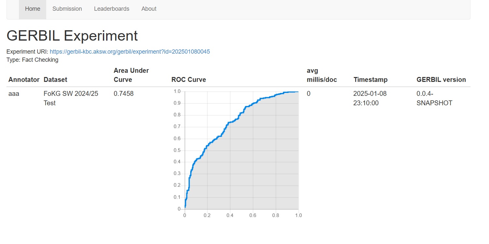

Project Briefing:

This project has 2 python files:

1. factChecker.py: This file contains the main logic, models and algorithm implemented using TransE and a MLP layer. The 1 time training takes more time and both the trained files are stored in trainedModel folder. A turtle file is generated for all the test triples and is saved in trainedModel folder. 

2. app.py: This file contains the flask UI implemented for inferening the output. User can enter a triple (s,p,o), calculate the veracity score. The user can also download a turtle file by clicking on the download link. 

Instructions to run the project:

Before proceeding to run the project, download the trained file of the reference dataset from:

https://uni-paderborn.sciebo.de/s/bX7aaQErnWisXft

Add this file to datasets/trainedModel folder

1. To test the working, open a command prompt and type python app.py to run the project.
2. Click on the http://127.0.0.1:5000/ link in command pallette to open the link. 
3. The UI will be rendered in a new browser window. 
4. Enter the data and proceed to test it. 

Please reach out to akbaum@campus.unipaderborn.de or ashikmr@campus.unipaderborn.de in case of any difficulties in running the project.

Sample UI:

Gerbil score:

Training screenshot:

