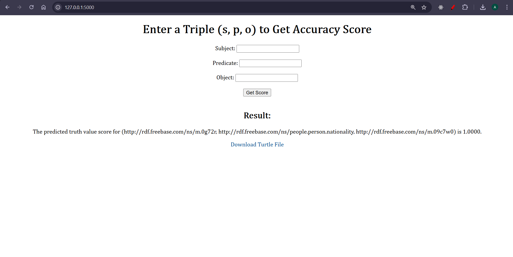
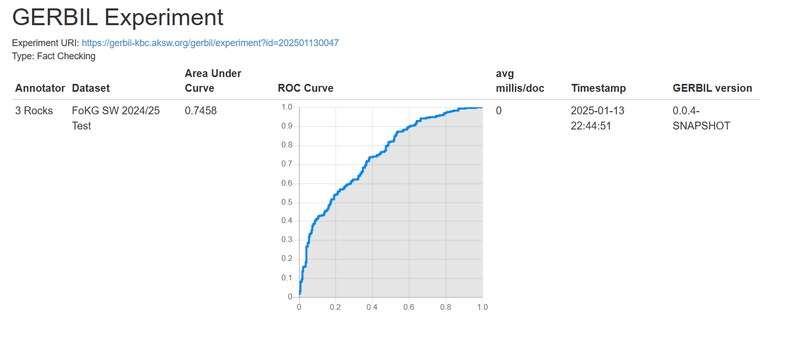

Project Briefing:

Idea:

1. Preprocessing Reference Knowledge Graph (KG):

The code processes a reference knowledge graph in .nt format (REFERENCE_DATASET).

Invalid triples are filtered, and the valid ones are written to a new file.

The filtered KG is loaded using rdflib.Graph and converted into a format compatible with PyKEEN (TriplesFactory).

2. Embedding Generation Using TransE:

A TransE model is initialized using the TriplesFactory. TransE generates embeddings for entities and relations by learning their representations in a vector space.

Hyperparameters like embedding dimension (embedding_dim), margin, and scoring function norm (L1 distance) are defined.

A manual training loop (SLCWATrainingLoop) is implemented to train the model with negative sampling for a specified number of epochs and batch size.

3. Parsing Reified Facts for Train/Test Data:

Reified facts are loaded from .nt train and test files using RDF parsing. These facts are tuples of subject, predicate, object, and truth value.

The truth value is used as a label for supervised training.

4. Embedding Lookup for Facts:

A function get_embedding_for_fact retrieves embeddings for a given (subject, predicate, object) triple. If an entity or relation is not in the model, a zero vector is returned.

This function is used to convert train and test triples into embedding vectors.

5. Training a Multi-Layer Perceptron (MLP):
An MLP classifier is trained on the embeddings of the train triples (X_train) with their associated truth values (y_train).

The classifier predicts truth values for the test triples. Performance is evaluated using AUC on the train set.

6. Storing Predictions:
The predicted truth values for the test triples are written to a .ttl file (RESULT_FILE) in RDF format.
Each triple's predicted truth value is serialized with the hasTruthValue predicate.

7. Saving Models and Artifacts:
The trained TransE model, TriplesFactory, and MLP classifier are saved for inferencing purpose.

################################################################################

GERBIL result url: https://gerbil-kbc.aksw.org/gerbil/experiment?id=202501130047

################################################################################

This project has 2 python files:

1. factChecker.py: This file contains the main logic, models and algorithm implemented using TransE and a MLP layer. The 1 time training takes more time and both the trained files are stored in trainedModel folder. A turtle file is generated for all the test triples and is saved in trainedModel folder. 

2. app.py: This file contains the flask UI implemented for inferening the output. User can enter a triple (s,p,o), calculate the veracity score. The user can also download a turtle file by clicking on the download link. 

Instructions to run the project:

Before proceeding to run the project, unzip the datasets file which contains all the training related files.

1. To test the working, open a command prompt and type python app.py to run the project.
2. Click on the http://127.0.0.1:5000/ link in command pallette to open the link. 
3. The UI will be rendered in a new browser window. 
4. Enter the data and proceed to test it. 

Please reach out to akbaum@campus.unipaderborn.de, ashikmr@campus.unipaderborn.de or sghosal@campus.uni-paderborn.de in case of any difficulties in running the project.

Sample UI:

Gerbil score:

Training screenshot:

